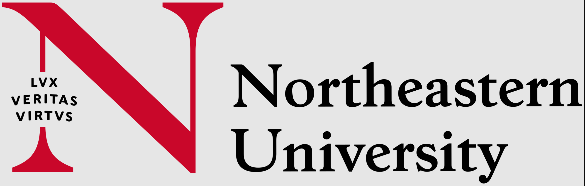

# CS 2500: Fundamentals of Computer Science 1

<div align="center">
  
  <br><br>
  <h2>Fundamentals of Computer Science 1</h2>
  <p><strong>5 Credit Hours | Khoury College of Science</strong></p>
</div>

## 📚 Course Overview

**CS 2500** introduces the fundamental ideas of computing and the principles of programming. The course discusses a systematic approach to word problems, including analytic reading, synthesis, goal setting, planning, plan execution, and testing. It presents several models of computing, starting from nothing more than expression evaluation in the spirit of high school algebra. This course assumes no prior programming experience; therefore, it is suitable for first-year students—majors and nonmajors alike—who wish to explore the intellectual ideas in the discipline.

## 📋 Course Details

| Category                    | Information |
| :-------------------------- | :---------- |
| **Semester**                | Spring 2025 |
| **Grade Earned**            | 98.76% (A)  |
| **Programming Language**    | Racket      |
| **Development Environment** | DrRacket    |

## 🏛️ Repository Structure

```
.
├── README.md          # Course information (this file)
├── Course File/       # Official Lecture Notes
├── Labs/              # Lab Assignments
├── Homework 1/        # Homework 1 Files
├── Homework 2/        # Homework 2 Files
├── ...                # Additional Homework Files
```

---

<div align="center">
  <p><em>© Vignesh Saravanakumar 2025 | Northeastern University</em></p>
</div>
